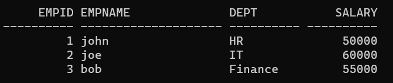

# Ex 4 Creating Procedures using PL/SQL
## DATE:
### AIM: 
To create a procedure using PL/SQL.

### Algorithm/Procedure:
1. Create employee table with following attributes (empid NUMBER, empname VARCHAR(10), dept VARCHAR(10),salary NUMBER);
2. Create a procedure named as insert_employee data.
3. Inside the procdure block, write the query for inserting the values into the employee table.
4. End the procedure.
5. Call the insert_employee data procedure to insert the values into the employee table.
6. Display the employee table

### Program:

```sql
create or replace procedure insert_employee_data AS
begin
insert into employee (empid,empname,dept,salary)
values (1,'john','HR',50000);
insert into employee (empid,empname,dept,salary)
values (2,'joe','IT',60000);
insert into employee (empid,empname,dept,salary)
values (3,'bob','Finance',55000);
commit;
end;
/
Procedure created.
begin
insert_employee_data;
end;
/
PL/SQL procedure successfully completed.
```
### Output:


## Result:
### Thus the procedure for using pl/sql is executed successfully.
